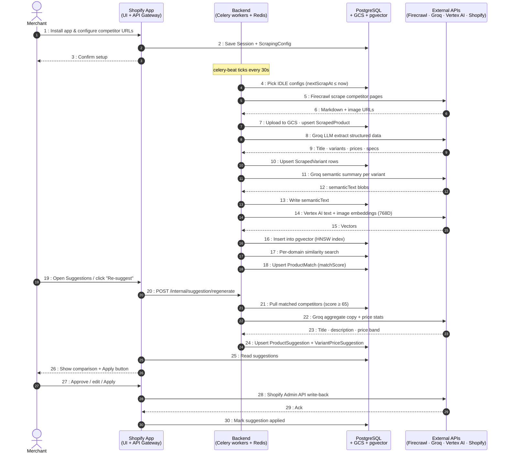

# MarketOS

A Shopify-embedded e-commerce intelligence platform for **dynamic pricing** and **competitive analysis**.

A merchant installs the app, points it at competitor URLs, and MarketOS continuously scrapes, extracts, embeds, matches, and suggests new titles / descriptions / prices for the merchant's catalogue — all reviewable from inside the Shopify Admin.

For a full architectural snapshot see [`PROJECT_SNAPSHOT.md`](PROJECT_SNAPSHOT.md). Visual data-flow diagram: [`docs/marketos_flow.png`](docs/marketos_flow.png).

---

## End-to-End User Flow (Sequence Diagram)



---

## Quick Start

### Frontend (`shopify_ui/`)

```bash
cd shopify_ui
npm run setup        # Prisma client + migrations
npm run dev          # Shopify CLI tunnel + Vite
```

### Python services

```bash
uv sync --frozen
docker-compose up    # Redis + all workers + beat + api-gateway
```

Required `.env`: `DATABASE_URL`, `REDIS_URL`, `FIRECRAWL_API_KEY`, `GROQ_API_KEY`, `GCS_IMAGE_BUCKET`, `GCS_MARKDOWN_BUCKET`, `VERTEX_PROJECT`, `VERTEX_LOCATION`, `GOOGLE_APPLICATION_CREDENTIALS`.

---

## Project Layout

| Path | Purpose |
|------|---------|
| `shopify_ui/` | React Router 7 embedded Shopify app (Prisma JS) |
| `services/api_gateway/` | FastAPI internal API (Shopify webhooks + suggestion triggers) |
| `services/scraper_svc/` | Firecrawl scrape · Groq extract · semantic summary · beat scheduler |
| `services/embedding_svc/` | Vertex AI text + image embeddings → pgvector |
| `services/matcher_svc/` | Per-domain HNSW similarity → `ProductMatch` |
| `services/suggestion_svc/` | Pricing stats + Groq copy → `ProductSuggestion` |
| `services/common/` | Shared Celery app, Prisma Python client, GCS helpers, schemas |
| `shopify_ui/prisma/` | Shared Prisma schema + migrations |
| `scripts/generate_flow_diagram.py` | Regenerates `docs/marketos_flow.png` |

---

## Tech Stack

**Frontend**: React 18 · React Router 7 · Vite · Shopify App Bridge · Prisma JS
**Backend**: Python 3.12 · Celery 5 · FastAPI · Prisma (Python) · SQLAlchemy
**Data**: PostgreSQL + pgvector (HNSW, 768D) · Redis · Google Cloud Storage
**AI**: Firecrawl (scrape) · Groq llama-3.1-8b-instant (extract / semantics / copy) · Vertex AI (text + multimodal embeddings)
